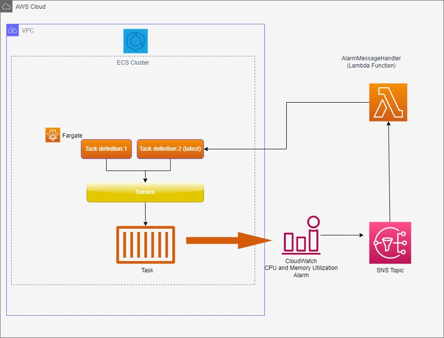

# Problem Statements/Requirements
AWS ECS deployment does not support vertical autoscaling.  Vertical autoscaling automatically adds more resource capacity, CPU or Memory, on the same instance.  Your development teams want to add this capability to their arsenal.  Your task is to provide a simplified solution architectural diagram and implementation in a language of your choice, such as python, javascript, java, Go, etc.  The code should be expected to run as a docker container in ECS or a lambda function.

## Solution

This solution enables vertical (cpu and memory) autoscaling on an ECS Cluster  by using a Lambda function written in Java and connected to the SNS Topic as a Subscriber.
Furthermore,I created  an alarm to monitor CPU and Memory Utilization metrics based on 80% threashold and which action is also connected to the same SNS Topic as a Producer.



Once the alarm is triggered, it send the message to the Lambda through the SNS Topic, which now uses the AWS SDK v2 to Fetch the TaskDefinition object, modified the CPU and Memory,update the Service with the New task which will then create a new version.


## Build and Deployment

For the Source to build, it requires the following Software requirments as well as AWS ACCESS AND SECRET KEYS. Also ensure the Environmental variables are set and their HOME defined on their PATHs.

* AWS CLI already configured
* [Java SE Development Kit 8 installed](http://www.oracle.com/technetwork/java/javase/downloads/jdk8-downloads-2133151.html)
* [Maven](https://maven.apache.org/install.html)
* [TerraForm installed](https://developer.hashicorp.com/terraform/downloads?product_intent=terraform)


We use `maven` to install our dependencies and package our application into a JAR file:
```bash
mvn clean verify package
```

## Simulation

## Further Enhancements


